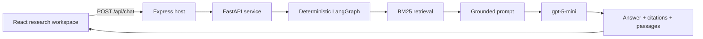

# Business Knowledge AI

> A source-grounded business research workspace built around the OpenStax *Introduction to Business* textbook.

[](https://busknowai-gpcbrjgv.manus.space)
[](https://react.dev/)
[](https://fastapi.tiangolo.com/)
[](https://langchain-ai.github.io/langgraph/)
[](LICENSE)

**Business Knowledge AI** answers business questions using retrieved passages from *Introduction to Business*. It presents generated responses as research notes with chapter, page, and source evidence, rather than treating the model output as an ungrounded answer.

**Live application:** [busknowai-gpcbrjgv.manus.space](https://busknowai-gpcbrjgv.manus.space)

## Why this project

The project is designed to make the provenance of an AI answer visible. Each response is produced through a fixed, non-agentic workflow that retains source metadata from retrieval through the final interface.

```text
Question
  → query processing
  → BM25 retrieval over OpenStax chunks
  → deterministic LangGraph orchestration
  → grounded prompt construction
  → gpt-5-mini generation
  → answer with textbook citations and retrieved passages
```

| Area | Implementation |
| --- | --- |
| User experience | React 19, Tailwind CSS 4, an editorial research-desk interface, responsive source review |
| Application host | Express 4 with a supervised FastAPI process and `POST /api/chat` proxy |
| RAG orchestration | A forward-only LangGraph workflow: process → retrieve → rerank stage → prompt → generate → format |
| Retrieval currently available | BM25 over provenance-preserving textbook chunks |
| Generation | `gpt-5-mini` through the server-side Manus Forge OpenAI-compatible API |
| Evidence | OpenStax source title, chapter, page, source URL, passage rank, and retrieved text |
| Validation | Vitest contracts for chat behavior and backend artifacts, plus TypeScript validation |

## Product experience

The current **Research Ledger** interface is a light editorial workspace built around three complementary views:

| View | Purpose |
| --- | --- |
| **Research Index** | Starts a new inquiry, preserves local conversation history, and keeps core textbook chapters in view. |
| **Research Note** | Presents a question and its grounded response in a readable, article-like format. |
| **Evidence Register** | Displays the retrieved OpenStax citations, chapter/page metadata, and supporting passages returned by the API. |

The interface intentionally does not expose autonomous-agent controls. It emphasizes readable answers, traceable evidence, and explicit application states when a source or generation result is unavailable.

## Architecture



The graph is intentionally deterministic. It has no autonomous agent, tool-calling loop, retrieval loop, self-correction loop, or model-directed routing.

## Repository structure

```text
business-knowledge-ai/
├── backend/                 # FastAPI RAG service and deterministic graph
├── client/                  # React + Tailwind research workspace
├── server/                  # Express host, proxy, lifecycle supervision, and tests
├── notebooks/               # Notebook-first source, ingestion, retrieval, and graph study
├── data/
│   ├── raw/                 # Local source metadata; the large PDF is intentionally ignored
│   └── processed/           # Auditable page, chunk, retrieval, and status artifacts
├── drizzle/                 # Application schema and migrations
├── .github/                 # Issue and pull-request templates
└── README.md
```

## Local development

### Prerequisites

Use a current Node.js release with Corepack / pnpm, Python 3.11 or later, and the project’s server-side environment variables. The Manus-managed deployment supplies those variables automatically; a standalone local environment must supply its own authorized values.

```powershell
cd "C:\Users\AbdElhalk\OneDrive\Desktop\RAG & LLMS Projects\Business Knowledge AI"
corepack enable
pnpm install
python -m pip install -r backend/requirements.txt
pnpm dev
```

Open [http://localhost:3000](http://localhost:3000). The Express host starts and supervises the FastAPI service for the chat route.

### Required server-side configuration

| Variable | Purpose |
| --- | --- |
| `RAG_GENERATION_MODEL` | Configured generation model. The deployed project uses `gpt-5-mini`. |
| `BUILT_IN_FORGE_API_URL` | Server-side Forge API base URL. |
| `BUILT_IN_FORGE_API_KEY` | Server-side Forge API credential. Never commit this value. |
| `OPENSTAX_GENERATIVE_AI_PERMISSION_CONFIRMED` | Explicit authorization gate for enabling generative processing of the source material. |

Do not commit `.env` files, provider credentials, or the locally acquired textbook PDF.

## Quality checks

```bash
pnpm test
pnpm check
```

The test suite covers the chat interface, API contracts, artifact integrity, and deterministic pipeline expectations. A successful local run should be accompanied by an actual `/api/chat` request when validating model access.

## Source material and responsible use

This project uses the official OpenStax *Introduction to Business* textbook as its source corpus. The textbook is openly accessible under **CC BY 4.0**, subject to the attribution and other conditions documented by OpenStax. The local PDF is deliberately excluded from Git because of its size and must be reacquired only from the official source.

> OpenStax also states that the book may not be used to train or otherwise ingest into large language models or generative-AI offerings without OpenStax’s permission. This project keeps an explicit server-side authorization gate for generative use.

| Source record | Location |
| --- | --- |
| Official book page | [OpenStax — Introduction to Business](https://openstax.org/details/books/introduction-business) |
| Local source metadata | [`data/raw/SOURCE.md`](data/raw/SOURCE.md) |
| Expected local PDF path | `data/raw/introduction-to-business-openstax.pdf` |
| Code license | [MIT](LICENSE) |

The **code** in this repository is MIT licensed. The OpenStax textbook and its associated licensing or permission conditions remain governed by their own terms and are not relicensed by this repository.

## Current limitations

The published system provides real BM25 retrieval and model-backed answer generation. Dense BGE-M3 retrieval, Qdrant-backed hybrid fusion, and BGE reranking are deliberately reported as unavailable unless their corresponding real artifacts have been produced. The application does not fabricate missing vectors, scores, passages, or citations.

## Contributing

Contributions are welcome. Please read [CONTRIBUTING.md](CONTRIBUTING.md) before opening an issue or pull request. Changes that affect retrieval, grounding, citations, source-data handling, or model generation must preserve the project’s provenance-first design.

## License

The application code is available under the [MIT License](LICENSE).

---

Built as a portfolio-ready, source-grounded AI application focused on transparent business research.
